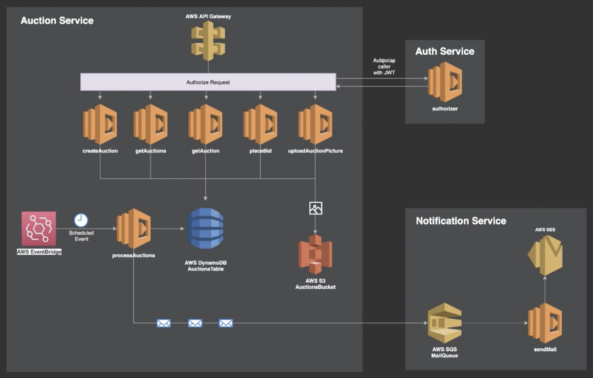

# Serverless auction service



## Plugin for SLS Node.js project

```text
https://github.com/zmzm/sls-node-base
```

## Application deploy

```text
sls deploy --stage dev --anothe_var some_value --verbose
```

## Application remove

```text
sls remove --verbose
```

### Function redeploy

```text
sls deploy function -f functionName
```

### Function logs

```text
sls logs -f functionName
```
